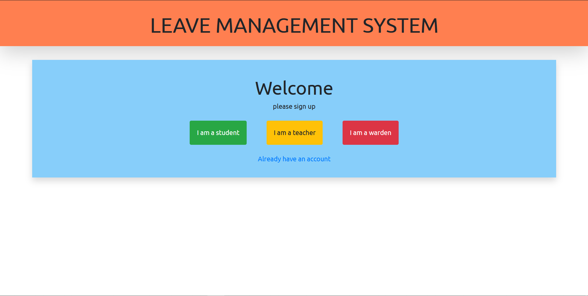

# hotel-leave-management-system

<ul><h2>Features:</h2></ul>
    <li>Authentication as student, teacher and warden</li>
    <li>Apply for leave</li>
    <li>Accept or Reject leave as a teacher</li>
    <li>Start and End leave as student</li>
    <li>mail verification to parent when leave accepted by mentor</li>
    <li>mail notification to mentor and parent when student leaves or returns hotel</li>

#Note:
    -change email_host_user to email in settings.py file to activate emailservice
